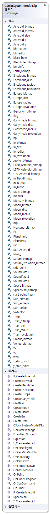

# SolarSystemModel

C++ MFC 를 이용한 태양계 시뮬레이터 입니다.

## 실행 파일

<del>[Download Link](https://github.com/psk876/SolarSystemModel/raw/master/SolarSystemModel.exe)</del>

## 영상

# 설명

태양계를 본떠 만든 프로그램입니다.

태양을 중심으로 행성들이 공전하며 행성마다 주요 행성들 또한 공전합니다.

랜덤 지점에서 소행성이 등장합니다.

일정 크기 이상의 소행성은 행성을 부시기도 합니다.

일정 크기 이하의 소행성과 충돌 시에는 행성이 붉게 변합니다.

* 목성형 행성은 소행성 충돌 시 파괴되지 않습니다.

* 위성들은 다른 객체들에 의해 영향을 받지 않습니다.

* 소행성 충돌 및 블랙홀에 의한 효과음을 구현

## 조작키

| MouseClick | KeyButton |
|:-------:|:-------:|
| LeftClick | PageUp |
| userID | PageDown |
|  | Backspace(←) |

마우스 왼쪽 버튼은 소행성 충돌로 인해 달아오른 행성을 원상 복구 시켜줍니다.

Page Up / Page Down 키를 사용하면 행성들의 공전 속도를 증가/하락시킬 수 있습니다. (한계 3배속 / 0배속)

Backspace(←) 키를 누르면 저장된 위치에 블랙홀이 생성되어 주변 행성들을 끌어들입니다.

일정 거리에 위치된 행성은 삭제됩니다.

# Class Diagram

## Asteroid_Info

## Planet_Info

## SolarSystemModelDlg

